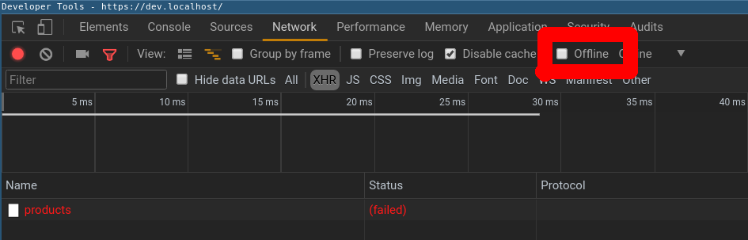

# pwatothevue

> PWA to the Vue

## Build Setup

# install dependencies
``` bash
npm install
```

# run servers

* serveur backend localhost:3000 : npm run server
* serveur de dev localhost:8080  : npm run dev
* serveur de prod localhost:8000 : npm run serve:dist
* backend + dev : npm run start
* backend + prod : npm run dist

# offline
La chrome dev tool permet d'interrompre le réseau :


# build for production with minification
``` bash
npm run build
```

# build for production and view the bundle analyzer report
``` bash
npm run build --report
```

# Créer une clé de souscription au Push Notification :
Suivre ce [tuto](https://web-push-codelab.glitch.me/)
